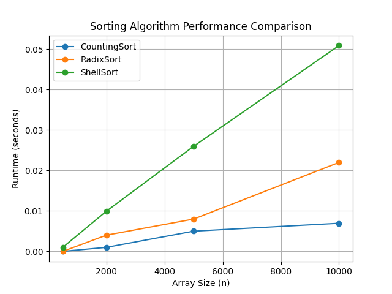
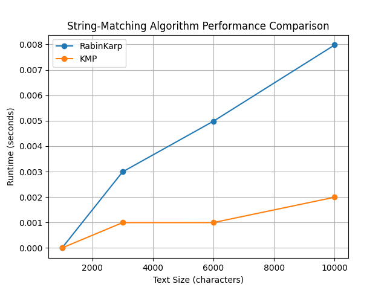
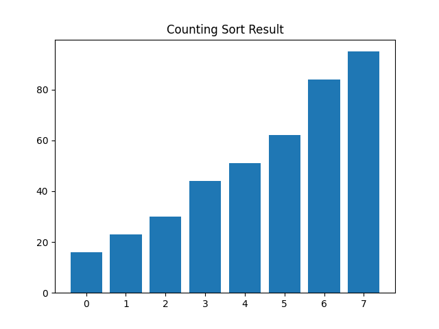
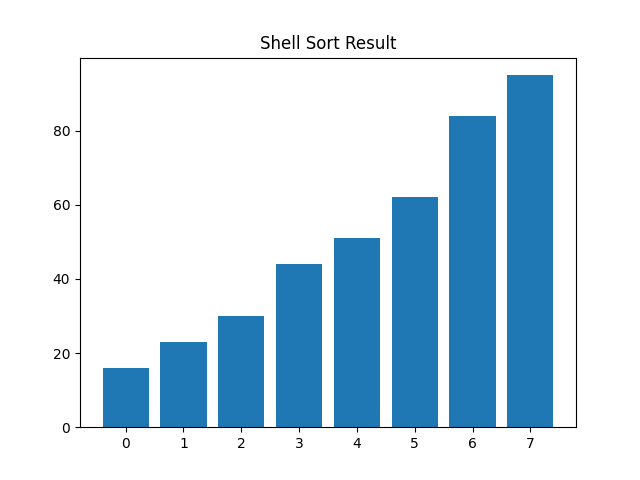
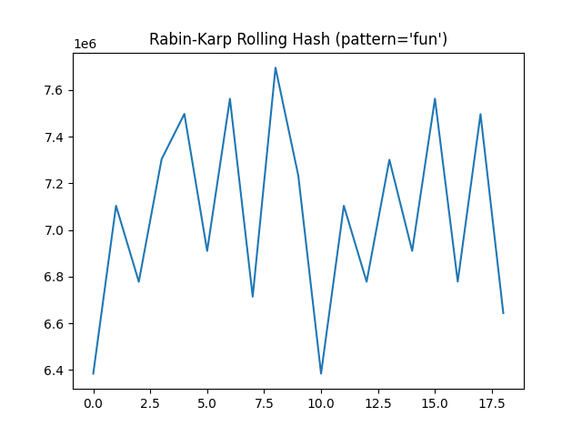
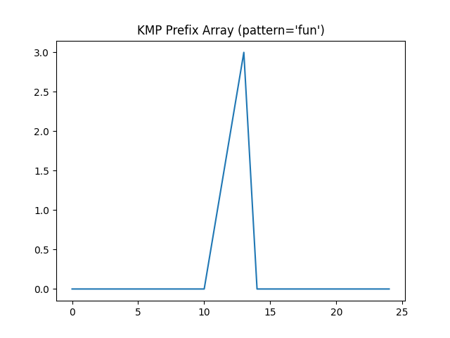
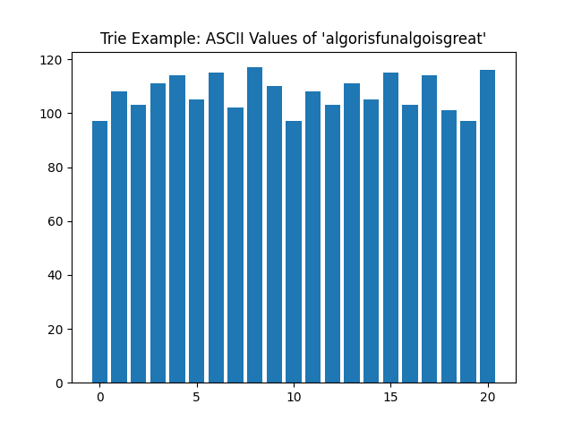

# Algorithm Performance Comparisons

This repository demonstrates:

1. **Three Sorting Algorithms**:
   - **Counting Sort**
   - **Radix Sort**
   - **Shell Sort**
2. **Two String-Matching Algorithms**:
   - **Rabin-Karp**
   - **KMP**
3. **Trie** (Prefix Tree) Data Structure

It **compares their performance** by measuring and plotting runtimes for randomly generated inputs of increasing size. Two plots are generated:

- **sorting_performance.png**  
  Comparing Counting Sort, Radix Sort, and Shell Sort.

- **string_matching_performance.png**  
  Comparing Rabin-Karp and KMP string-search algorithms.

---

## Brief Overview of Algorithms

1. **Counting Sort**  
   - **Time Complexity**: $O(n + k)$  
   - Works by counting frequencies of each distinct value, then mapping them back into the output array.

2. **Radix Sort**  
   - **Time Complexity**: $O(d \times (n + k))$, where *d* is the number of digits in the max element.  
   - Sorts integers digit-by-digit using a stable sub-sort (Counting Sort).

3. **Shell Sort**  
   - **Time Complexity**: Typically $O(n^{1.3})$ to $O(n^{2})$ depending on the gap sequence.  
   - Generalized Insertion Sort that starts with a large gap, reducing it each pass.

4. **Rabin-Karp**  
   - **Average Time**: $O(n + m)$, **Worst**: $O(nm)$.  
   - Uses rolling hash to quickly compare a pattern’s hash with a text window’s hash. Character-by-character check on hash collisions.

5. **KMP (Knuth-Morris-Pratt)**  
   - **Time Complexity**: $O(n + m)$.  
   - Uses a prefix function (“failure function”) to skip redundant comparisons.

6. **Trie**  
   - **Insert/Query** each take $O(\ell)$, where $\ell$ is the length of the word.  
   - A prefix tree that stores characters along paths, helpful for efficient prefix lookups.

---

## Example Plots

### Sorting Performance:

### String-Matching Performance:

---

# Sorting and String Matching Algorithm Visualizations

### Counting Sort  

### Radix Sort  

### Shell Sort  

### Rabin-Karp Rolling Hash  

### Knuth-Morris-Pratt (KMP) Prefix Array  

### Trie Visualization (ASCII Values)  

